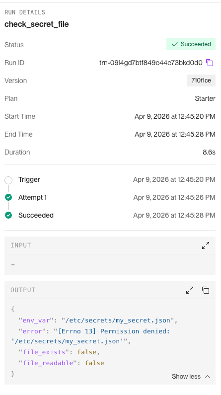
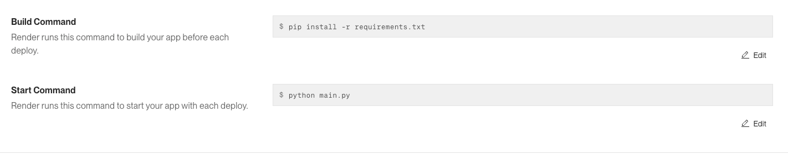
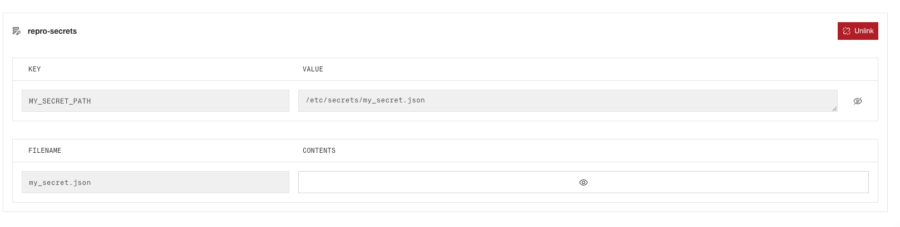

# Render Workflows: Secret Files Not Available in Task Instances

## Issue

Secret files mounted via env groups or directly on a Workflow service are
**not accessible** in ephemeral Workflow task instances. The same secret
files work correctly on web services and background workers.

## Expected Behavior

A secret file added to the Workflow service (either directly or via an env
group) should be available at `/etc/secrets/<filename>` when a task runs,
just like it is for web services and background workers.

## Actual Behavior

The file at `/etc/secrets/<filename>` does not exist inside the Workflow
task instance. `os.path.exists()` returns `False` and `open()` raises
`Permission denied`.

Task output confirms the file is not accessible:

## Reproduction Steps

1. Create a **Workflow** service in the Render Dashboard
   (blueprints don't support the workflow type yet)
2. Link this repo, set build command `pip install -r requirements.txt`,
   start command `python main.py`

   

3. Add a secret file named `my_secret.json` with any JSON content
   (via Dashboard > Environment > Secret Files, or via an env group)

   

4. Set env var `MY_SECRET_PATH=/etc/secrets/my_secret.json`
5. Trigger the `check_secret_file` task from the Dashboard
6. Check the task run output — the file will not be found

## Environment

- Render SDK: 0.6.x
- Python: 3.12
- Service type: Workflow (beta)

## Workaround

Pass credentials as a regular environment variable (e.g. base64-encoded
JSON) and write them to a temp file at task startup.
